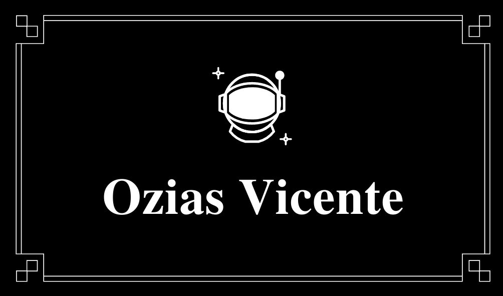

<!DOCTYPE html>

 <html> 
     <head> <!--Providencia informações gerais-->
 								<meta charset="utf-8">  <!-- representa qualquer caractere de qualquer idioma-->
 								<title> PROJETO EJECT </title> 
            <link rel="stylesheet" type="text/css" href="jk.css" media="screen" />
 		  </head>
 		
 		   
       <body>
 		  				
 		    <header>  <!-- Cabeçalho -->
 		    
 <!-- é um container utilizado para agrupar elementos -->
       <nav id="menur"> <!-- representa uma seção de uma página -->
      
       <ul> <!-- representa uma lista de itens -->
                   <li> <!-- usado para representar um item que faz parte de uma lista -->
       												<a href="#sobrem" id="fon">Sobre mim</a>
       					     </li> 
       					     <li>
       					     				<a href="#formac" id="fon2">Formação</a>
       					     </li> 
       					     <li>
       					     				<a href="#interess" id="fon3">Interesse</a></li> 
       					     <li>
       					     				<a href="#curiosid" id="fon4">Curiosidades</a>
       					     </li> 
       					     <li>
       					     				<a href="https://www.friv.com/z/games/roboherobluezone/game.html?AndroidFst-x-x-w-x-x-xx">Missão</a>
       					     </li> 
       </ul>
       
       </nav>
       

       </header> 
       
       	
 							  <header id="ob">  <!-- Cabeçalho -->
 							  
             </header> 
             
     
       <section id="fundo">
 						<!--  

 							  
            <main class="conteudo"> <!-- define o conteúdo principal dentro do <body> --> 
 							  		
 							  		
              
 
              				
                 
Sobre mim

                 	  	
             <!--     

                 				
 				    			  		
 							  	
 							  	   
  -->
              
 <!-- O contéudo do elemento aside pode ser aninhado dentro do conteúdo do elemento main --> 
            
            		
 
              
Formação 
							  				
              
 							   
 <!-- O contéudo do elemento aside pode ser aninhado dentro do conteúdo do elemento main --> 
         
 							   
 					    
 
 							   			  	
 							   			
Interesse
							  				
                 
 	          
 
 	          
 	          

 	          				
 	          				
Curiosidades
							  				
                  	
                 
 	          

 	          
 	          
 	            
 							 </main> <!-- Esse é o rodapé principal que vai ser usado em todas as páginas do nosso website --> 
 							   	 
 							   	 <footer> 
 							   	 				
©Copyright 2050 by nobody. All rights reversed.
 
 							   	 </footer>
     
     
       </section>
       </body>
 		  
 </html>
