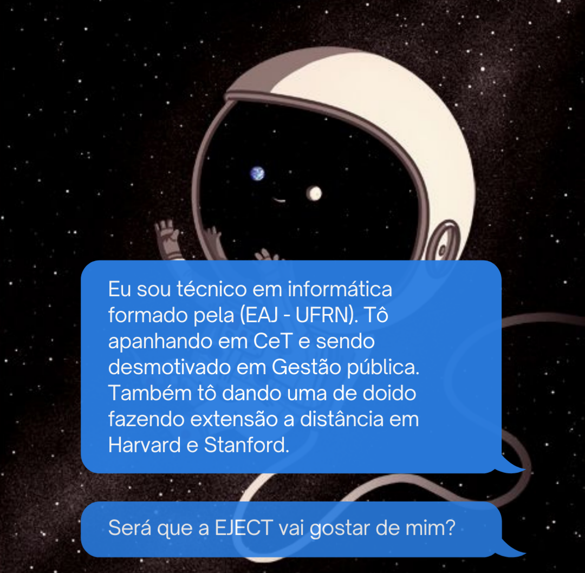

<!DOCTYPE html>

 <html> 
     <head> <!--Providencia informações gerais-->
 								<meta charset="utf-8">  <!-- representa qualquer caractere de qualquer idioma-->
 								<title> PROJETO EJECT </title> 
            <link rel="stylesheet" type="text/css" href="jk.css" media="screen" />
 		  </head>
 		
 		   
       <body>
 		  				
 		    <header>  <!-- Cabeçalho -->
 		    
 <!-- é um container utilizado para agrupar elementos -->
       <nav id="menur"> <!-- representa uma seção de uma página -->
      
       <ul> <!-- representa uma lista de itens -->
                   <li> <!-- usado para representar um item que faz parte de uma lista -->
       												<a href="#sobrem" id="fon">Sobre mim</a>
       					     </li> 
       					     <li>
       					     				<a href="#formac" id="fon2">Formação</a>
       					     </li> 
       					     <li>
       					     				<a href="#interess" id="fon3">Interesse</a></li> 
       					     <li>
       					     				<a href="#curiosid" id="fon4">Curiosidades</a>
       					     </li> 
       					     <li>
       					     				<a href="https://www.friv.com/z/games/roboherobluezone/game.html?AndroidFst-x-x-w-x-x-xx">Missão</a>
       					     </li> 
       </ul>
       
       </nav>
       

       </header> 
       
       	
 							  <header id="ob">  <!-- Cabeçalho -->
 							  
             </header> 
             
     
       <section id="fundo">
 						<!--  

 							  
            <main class="conteudo"> <!-- define o conteúdo principal dentro do <body> --> 
 							  		
 							  		
              
 
              				
                 
Sobre mim

                 	  	
             <!--     

                 				
 				    			  		
 							  	
 							  	   
  -->
              
 <!-- O contéudo do elemento aside pode ser aninhado dentro do conteúdo do elemento main --> 
            
            		
 
              
Formação 
							  				
              
 							   
 <!-- O contéudo do elemento aside pode ser aninhado dentro do conteúdo do elemento main --> 
         
 							   
 					    
 
 							   			  	
 							   			
Interesse
							  				
                 
 	          
 
 	          
 	          

 	          				
 	          				
Curiosidades
							  				
                  	
                 
 	          

 	          
 	          
 	            
 							 </main> <!-- Esse é o rodapé principal que vai ser usado em todas as páginas do nosso website --> 
 							   	 
 							   	 <footer> 
 							   	 				
©Copyright 2050 by nobody. All rights reversed.
 
 							   	 </footer>
     
     
       </section>
       </body>
 		  
 </html>
body { 
  background-image: url("naom_5eb56bada8a0e.jpg");
  
    
   background-repeat: no-repeat; 
  /* -moz-background-size: 100% 100%;*/
  /*  -webkit-background-size: 100% 100%; */
   background-size: 100% 100%;
 
 
} 
.conteudo{
				display: flex;
				width:100%;
				height: auto;
				flex-wrap: wrap;
				
				
				
}
.gaga{
/*	background-color:black; 
	text-align: center;
	width: 50%; 
	border-radius: 20px;
	float: left;
	align-items: center;
	height:600px;*/
	display: flex;
	flex-direction: column;
	align-items: center;
	

	background-color:black; 
	text-align: center;
	width: 50%; 
	border-radius: 20px;
 /*float: left;*/
	height:600px;
/*	float: left;*/
}

.gaga2 img{
 width: 70%;
 heigth: 40px;
 
				
}
.gaga2{
	background-color:black; 
	text-align: center;
	width: 50%; 
	border-radius: 20px;
 /*float: left;*/
	height:600px;
		
			
			
}
.gaga3{
	background-color:black; 
	text-align: center;
	width: 50%; 
	border-radius: 20px;
 /*float: left;*/
	height:600px;		
}
.gaga3 img{
 width: 70%;
 heigth: 40px;
 
				
}
.gaga4{
	background-color:black; 
	text-align: center;
	width: 50%; 
	border-radius: 20px;
 /*float: left;*/
	height:600px;		
}
.gaga4 img{
 width: 70%;
 heigth: 40px;
 
				
}

.gagaimg{
 heigth:90%;
 width: 80%;
							
}
.gaga img{
 /*width: 100%;
 heigth: 100%;*/
 width: 70%;
 heigth: 40px;
				
}

#ob{
	background-color:black; 
	text-align: center;
}
#fundo { 
  background-color: #0a1737;
  background: gray;
  opacity: 0.95;
  height: auto;
  width:100%;
}
#menur ul{ 
  max-width: float;
  padding:0px; 
  background-color:#EDEDED; 
  list-style:none;
}
#menur ul li { 
  display: inline;
}
#menur ul li a { 
  padding: 20px; 
  display: inline-block; /* visual do link */  
  color: #333; 
  text-decoration: none;
  border-bottom:3px solid #EDEDED; 
  transition: background .4s;
  
}
#menur ul li a:hover { 
  background-color:gray; 
  color: #blue; 
  border-bottom:3px solid gray;
  transition: border-bottom .4s;
  
  }
#menur ul li:last-child a { 
  float: right;
  }
#primeiro_h1{ 
  color: white; 
  padding: 60px; 
}
#primeiro_h2{ 
  color: white; 
  padding: 60px; 
}
#segundo_h2{ 
  color: white;
  padding: 60px; 
}
footer {
  
  text-align: center;
  background: white;
} 
.paragrafor1{
  color: white;
}
.
#par{
  background-color: white;
  color:white;
}
.vivo{
    
				width:50%;
				max-heigth:600px;
				background-color: blue;
}
.vivo2{

				width:50%;
				heigth:600px;
				background-color: pink;
}
/* @media (max-width: 768px) {} */
@media (max-width:1000px) {
      .gaga{
							
					   		heigth: 400px;
				}
				.gaga2{
								heigth: 400px;
				}
				
}
#formac{
		
				
}
